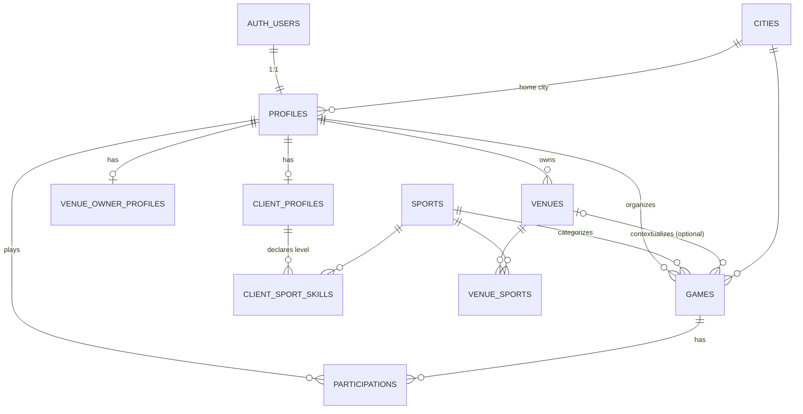

# Database Schema & Backend Design (v1)

> **Provenance:** generated in the SQUAD brainstorm vault (`sport_app_brainstorm/output/2026-05-29-db-schema-and-backend-design.md`) and copied here as a handoff reference, with Obsidian wikilinks flattened to plain text. The vault remains the one-way source of truth — regenerate on change rather than editing this copy in place. Live ERD board: https://miro.com/app/board/uXjVHMLmYbQ=/

## 0. How to read this

This is the **data-layer design** for the SQUAD multi-sport coordination MVP, derived directly from the Phase 1 PRD. It was produced _schema-first_: §1 restates the **already-decided** architecture as confirmed context (not re-opened), and §2–§6 are the new design work — the schema, indexing, authorization/RLS, and API surface that fall out of it.

- **Scope boundary:** implemented in the **separate app repo**; this vault stays the product/research source of truth. Schema source of truth = SQL migrations (`migrations/`), per App Foundation — Portable Seams.
- **Status:** draft for review. Field mandatory/optional rules and a few seams remain open (see §8).

## 1. Confirmed architecture context (not re-opened here)

These were settled before this design and are cited, not re-decided:

| Dimension              | Decision                                                                                                                           | Source                                     |
| ---------------------- | ---------------------------------------------------------------------------------------------------------------------------------- | ------------------------------------------ |
| Architecture pattern   | **Modular monolith** — one Next.js app, two route groups (`/app`, `/venue`), one shared backend                                    | Decision Log, Foundation vs Market         |
| Communication          | App-owned **REST** route handlers → `lib/booking` domain module → **Drizzle ORM** → Postgres. No GraphQL/gRPC/event bus (deferred) | Portable Seams §3, §10                     |
| Data pattern           | **CRUD** (no CQRS / Event Sourcing — "don't over-engineer the MVP")                                                                | Portable Seams §11; Database Schema Design |
| Database / Auth / Host | **Supabase Postgres + Supabase Auth + Vercel** (proposed), DB & auth behind seams                                                  | Non-Decisions                              |
| Identity model         | **Shared account + split surface profiles** (chosen this session)                                                                  | §2 below                                   |
| Lookahead              | **Lean + cheap seams** (chosen this session)                                                                                       | §2–§8                                      |

## 2. Entity model

Ten tables. Identity uses the shared-account + split-profile model; `sports` and `cities` are lookup tables (not enums) so their sets can grow without a migration; spots-remaining is **derived** (count of `approved` participations), never stored. Phone lives in `auth.users` only — it is never mirrored onto `profiles` (privacy; see §3).

**Live diagram (Miro):** https://miro.com/app/board/uXjVHMLmYbQ=/ — the interactive ERD/board version of this schema.



**Deferred-with-seams (intentionally absent in v1):** teams/groups, a real `bookings`/slots table, ratings/reviews, recurring-game model, chat. Each has a documented seam in the foundation plan; none is modeled now.

## 3. Tables — columns, types, constraints

```sql
-- Enums
CREATE TYPE participation_status AS ENUM ('requested','approved','declined','cancelled');
CREATE TYPE game_status          AS ENUM ('open','cancelled');   -- 'completed' deferred
-- Ordered low→high so app code can compute "below required" (advisory only).
CREATE TYPE skill_level          AS ENUM ('beginner','intermediate','amateur','advanced','professional');

-- Reference: cities lookup (like sports — lookup table so it can grow)
CREATE TABLE cities (
  id             smallint GENERATED ALWAYS AS IDENTITY PRIMARY KEY,
  key            text NOT NULL UNIQUE,        -- 'baku', 'ganja', ...
  name           text NOT NULL,
  display_order  smallint NOT NULL DEFAULT 0,
  is_active      boolean NOT NULL DEFAULT true
);   -- seeded with major Azerbaijani cities via migration

-- Identity (Option B: shared account + split surface profiles)
-- NOTE: phone is NOT here — it lives in auth.users only (privacy; see Auth § below).
CREATE TABLE profiles (
  id            uuid PRIMARY KEY REFERENCES auth.users(id) ON DELETE CASCADE,
  full_name     text NOT NULL,
  display_name  text,                         -- optional public handle; falls back to full_name
  avatar_url    text,
  city_id       smallint REFERENCES cities(id) ON DELETE SET NULL,
  created_at    timestamptz NOT NULL DEFAULT now(),
  updated_at    timestamptz NOT NULL DEFAULT now()
);

-- Marks "this profile uses the client app". Player vs organizer is a per-GAME
-- role (games.organizer_id / participations.player_id), NOT a per-user flag:
-- any client user can both create and join games. Kept distinct from
-- venue_owner_profiles because /app and /venue are separate surfaces.
CREATE TABLE client_profiles (
  profile_id    uuid PRIMARY KEY REFERENCES profiles(id) ON DELETE CASCADE,
  created_at    timestamptz NOT NULL DEFAULT now(),
  updated_at    timestamptz NOT NULL DEFAULT now()
);

-- A client's declared level per sport. Advisory: nothing here gates joining a
-- game — the value drives the organizer's "below required" indicator only.
CREATE TABLE client_sport_skills (
  profile_id   uuid     NOT NULL REFERENCES client_profiles(profile_id) ON DELETE CASCADE,
  sport_id     smallint NOT NULL REFERENCES sports(id) ON DELETE RESTRICT,
  skill_level  skill_level NOT NULL,
  created_at   timestamptz NOT NULL DEFAULT now(),
  updated_at   timestamptz NOT NULL DEFAULT now(),
  PRIMARY KEY (profile_id, sport_id)
);
CREATE INDEX client_sport_skills_sport_idx ON client_sport_skills (sport_id);

CREATE TABLE venue_owner_profiles (
  profile_id     uuid PRIMARY KEY REFERENCES profiles(id) ON DELETE CASCADE,
  business_name  text,
  contact_phone  text,
  contact_email  text,
  created_at     timestamptz NOT NULL DEFAULT now(),
  updated_at     timestamptz NOT NULL DEFAULT now()
);

-- Reference
CREATE TABLE sports (
  id             smallint GENERATED ALWAYS AS IDENTITY PRIMARY KEY,
  key            text NOT NULL UNIQUE,        -- 'football', 'padel', ...
  name           text NOT NULL,
  display_order  smallint NOT NULL DEFAULT 0,
  is_active      boolean NOT NULL DEFAULT true
);   -- seeded with the 8 sports via migration

-- Venues (defined before games: games.venue_id references it)
CREATE TABLE venues (
  id            uuid PRIMARY KEY,   -- UUIDv7, generated app-side in lib/booking (see note)
  owner_id      uuid NOT NULL REFERENCES profiles(id) ON DELETE CASCADE,
  name          text NOT NULL,
  address       text,
  contact_info  text,
  description   text,
  created_at    timestamptz NOT NULL DEFAULT now(),
  updated_at    timestamptz NOT NULL DEFAULT now(),
  deleted_at    timestamptz
);

-- Core coordination loop
CREATE TABLE games (
  id            uuid PRIMARY KEY,   -- UUIDv7, generated app-side in lib/booking (see note)
  organizer_id  uuid NOT NULL REFERENCES profiles(id) ON DELETE CASCADE,
  sport_id      smallint NOT NULL REFERENCES sports(id) ON DELETE RESTRICT,
  venue_id      uuid REFERENCES venues(id) ON DELETE SET NULL,   -- optional context
  title         text NOT NULL,
  starts_at     timestamptz NOT NULL,
  skill_level   skill_level,                  -- null = all levels; minimum semantics (advisory)
  ends_at       timestamptz,                  -- optional; CONSTRAINT chk_games_ends_after_starts
  city_id       smallint REFERENCES cities(id) ON DELETE SET NULL,
  capacity      smallint NOT NULL CHECK (capacity > 0),
  location_text text,                          -- nullable in v1 (validation later)
  notes         text,
  status        game_status NOT NULL DEFAULT 'open',
  share_token   text,                          -- ★ invite/share seam
  created_at    timestamptz NOT NULL DEFAULT now(),
  updated_at    timestamptz NOT NULL DEFAULT now(),
  deleted_at    timestamptz,                   -- ★ soft delete
  CONSTRAINT chk_games_ends_after_starts CHECK (ends_at IS NULL OR ends_at > starts_at)
);

CREATE TABLE participations (
  id            uuid PRIMARY KEY,   -- UUIDv7, generated app-side in lib/booking (see note)
  game_id       uuid NOT NULL REFERENCES games(id) ON DELETE CASCADE,
  player_id     uuid NOT NULL REFERENCES profiles(id) ON DELETE CASCADE,
  status        participation_status NOT NULL DEFAULT 'requested',
  requested_at  timestamptz NOT NULL DEFAULT now(),
  decided_at    timestamptz,
  created_at    timestamptz NOT NULL DEFAULT now(),
  updated_at    timestamptz NOT NULL DEFAULT now(),
  CONSTRAINT uq_participation UNIQUE (game_id, player_id)   -- ★ one request per player
);

CREATE TABLE venue_sports (
  venue_id  uuid NOT NULL REFERENCES venues(id) ON DELETE CASCADE,
  sport_id  smallint NOT NULL REFERENCES sports(id) ON DELETE RESTRICT,
  PRIMARY KEY (venue_id, sport_id)
);
```

**Confirmed decisions:** `games.organizer_id` is `ON DELETE CASCADE` (account deletion removes its games + cascades to participations; soft-delete is the normal path anyway); `location_text` is nullable for v1. **UUID PKs are UUIDv7 generated in `lib/booking`** (time-ordered — avoids the random-v4 B-tree index fragmentation flagged in Database Schema Design), so PK columns carry **no** `gen_random_uuid()` default and the app always supplies the id.

## 4. Indexing strategy

Driven by the real query patterns, not speculative:

| Index                                                                   | Serves                                                      |
| ----------------------------------------------------------------------- | ----------------------------------------------------------- |
| `games(sport_id, starts_at)`                                            | Browse by sport, time-sorted (player's primary query)       |
| `games(city_id, starts_at) WHERE deleted_at IS NULL` (partial)          | City-based discovery feed                                   |
| `games(starts_at) WHERE status='open' AND deleted_at IS NULL` (partial) | "Upcoming open games" feed                                  |
| `games(organizer_id) WHERE deleted_at IS NULL` (partial)                | Organizer dashboard                                         |
| `games(venue_id) WHERE venue_id IS NOT NULL` (partial)                  | A venue's games                                             |
| `participations(game_id, status)`                                       | Request management; counting `approved` for spots-remaining |
| `participations(player_id)`                                             | Player's "my requests/games"                                |
| `UNIQUE(game_id, player_id)`                                            | Idempotent join + game-prefix scans                         |
| `UNIQUE(games.share_token) WHERE share_token IS NOT NULL` (partial)     | Invite-link resolution                                      |
| `venues(owner_id) WHERE deleted_at IS NULL` (partial)                   | Venue-owner dashboard                                       |
| `venue_sports(sport_id)`                                                | "Venues supporting sport X"                                 |
| `client_sport_skills(sport_id)`                                         | "All players with a level for sport X"                      |

Primary keys are auto-indexed; FK columns that aren't already index-leading get their own index above.

## 5. Authorization & RLS (defense in depth)

**Authorization is enforced in the app layer; RLS is not a backstop on the `/api/v1` path.** The app `lib/booking` module + route guards (`getCurrentUser`/`requireUser` + explicit ownership checks) are the **sole real authorization guard** for `/api/v1`. RLS backstops only the **PostgREST / Data-API / Storage / Realtime** path — it is **inert over the Drizzle/postgres-js owner connection** used by `/api/v1`: `lib/db/client.ts` connects as the owning `postgres` role (which bypasses RLS unless `FORCE ROW LEVEL SECURITY` is set — migrations only `ENABLE`), and even ignoring ownership, `auth.uid()` reads `request.jwt.claims`, a GUC the postgres-js session never sets (→ `NULL`). So there is **no** "RLS holds even if app code has a bug" on this path: a missing ownership check is an open door. The executable proof is `src/lib/db/rls.integration.test.ts` — policies bite only inside the `asUser` transaction that sets `role` + `request.jwt.claims`; plain Drizzle writes bypass them. `auth.uid()` = `profiles.id` (used by the policies that _do_ run, i.e. the Data-API path). Keep RLS enabled as cheap insurance against an accidental Data-API exposure only — do **not** make it load-bearing (making it real needs a non-owner `authenticated` role + per-txn `SET LOCAL request.jwt.claims`, which would couple the portable DB seam to Supabase's `auth.uid()` convention — a deliberate non-goal in v1).

### AuthZ matrix

| Resource                      | Read                                                 | Create                                              | Update                                            |
| ----------------------------- | ---------------------------------------------------- | --------------------------------------------------- | ------------------------------------------------- |
| profiles                      | authenticated (display fields)                       | trigger (on signup)                                 | self                                              |
| client / venue_owner profiles | self                                                 | self                                                | self                                              |
| client_sport_skills           | authenticated (organizers need requesters' levels)   | self                                                | self                                              |
| sports                        | authenticated                                        | — seeded                                            | — service-role                                    |
| cities                        | authenticated                                        | — seeded                                            | — service-role                                    |
| games                         | authenticated non-deleted; organizer sees own always | any client (has `client_profiles`)                  | owning organizer                                  |
| participations                | the player **or** the game's organizer               | any client (has `client_profiles`), on an open game | organizer (approve/decline) · player (cancel own) |
| venues                        | public non-deleted                                   | venue owner                                         | owner                                             |
| venue_sports                  | public                                               | venue owner                                         | venue owner                                       |

### Enable RLS + policies (all 10 tables)

RLS is enabled on **every** table — a table with RLS on and _no_ policy denies all access, so each one gets explicit policies. All policies use `TO authenticated` and wrap helper calls as `(select auth.uid())`, so they run **once per query, not per row** (Supabase advisor `0003_auth_rls_initplan`).

```sql
-- profiles — created by trigger (below); self-update; display fields readable to all signed-in users.
-- Holds ONLY display fields, so a broad SELECT is safe. If a sensitive column is ever added, move it
-- to a private table OR expose a view WITH (security_invoker = true) — plain views bypass RLS.
-- NOTE: phone is NOT on profiles — it lives in auth.users only (privacy; native Supabase Auth phone OTP).
ALTER TABLE profiles ENABLE ROW LEVEL SECURITY;
CREATE POLICY profiles_select ON profiles FOR SELECT TO authenticated USING (true);
CREATE POLICY profiles_update ON profiles FOR UPDATE TO authenticated
  USING ((select auth.uid()) = id) WITH CHECK ((select auth.uid()) = id);
-- no INSERT policy: rows are created by the handle_new_user trigger, not by clients

-- client_profiles / venue_owner_profiles — fully self-only (a SELECT policy is REQUIRED for UPDATE to work)
ALTER TABLE client_profiles ENABLE ROW LEVEL SECURITY;
CREATE POLICY client_self ON client_profiles FOR ALL TO authenticated
  USING ((select auth.uid()) = profile_id) WITH CHECK ((select auth.uid()) = profile_id);
ALTER TABLE venue_owner_profiles ENABLE ROW LEVEL SECURITY;
CREATE POLICY venue_owner_self ON venue_owner_profiles FOR ALL TO authenticated
  USING ((select auth.uid()) = profile_id) WITH CHECK ((select auth.uid()) = profile_id);

-- client_sport_skills — readable by all authenticated (organizers need requesters' levels); writable by self
ALTER TABLE client_sport_skills ENABLE ROW LEVEL SECURITY;
CREATE POLICY csk_select ON client_sport_skills FOR SELECT TO authenticated USING (true);
CREATE POLICY csk_write ON client_sport_skills FOR ALL TO authenticated
  USING ((select auth.uid()) = profile_id) WITH CHECK ((select auth.uid()) = profile_id);

-- sports + cities — public reference; writes are service-role only (no write policy → denied)
ALTER TABLE sports ENABLE ROW LEVEL SECURITY;
CREATE POLICY sports_read ON sports FOR SELECT TO authenticated USING (true);
ALTER TABLE cities ENABLE ROW LEVEL SECURITY;
CREATE POLICY cities_read ON cities FOR SELECT TO authenticated USING (true);

-- venue_sports — public reference; writes by venue owner
ALTER TABLE venue_sports ENABLE ROW LEVEL SECURITY;
CREATE POLICY vsports_read ON venue_sports FOR SELECT TO authenticated USING (true);
CREATE POLICY vsports_write ON venue_sports FOR ALL TO authenticated
  USING (EXISTS (SELECT 1 FROM venues v WHERE v.id = venue_id AND v.owner_id = (select auth.uid())))
  WITH CHECK (EXISTS (SELECT 1 FROM venues v WHERE v.id = venue_id AND v.owner_id = (select auth.uid())));

-- games
ALTER TABLE games ENABLE ROW LEVEL SECURITY;
CREATE POLICY games_select ON games FOR SELECT TO authenticated
  USING (deleted_at IS NULL OR organizer_id = (select auth.uid()));
CREATE POLICY games_insert ON games FOR INSERT TO authenticated
  WITH CHECK (organizer_id = (select auth.uid())
    AND EXISTS (SELECT 1 FROM client_profiles c WHERE c.profile_id = (select auth.uid())));
CREATE POLICY games_update ON games FOR UPDATE TO authenticated
  USING (organizer_id = (select auth.uid())) WITH CHECK (organizer_id = (select auth.uid()));

-- participations — UPDATE carries BOTH using + with check (without with check, a row could be reassigned)
ALTER TABLE participations ENABLE ROW LEVEL SECURITY;
CREATE POLICY part_select ON participations FOR SELECT TO authenticated
  USING (player_id = (select auth.uid())
    OR EXISTS (SELECT 1 FROM games g WHERE g.id = game_id AND g.organizer_id = (select auth.uid())));
CREATE POLICY part_insert ON participations FOR INSERT TO authenticated
  WITH CHECK (player_id = (select auth.uid())
    AND EXISTS (SELECT 1 FROM client_profiles c WHERE c.profile_id = (select auth.uid()))
    AND EXISTS (SELECT 1 FROM games g WHERE g.id = game_id AND g.status='open' AND g.deleted_at IS NULL));
CREATE POLICY part_update ON participations FOR UPDATE TO authenticated
  USING (player_id = (select auth.uid())
    OR EXISTS (SELECT 1 FROM games g WHERE g.id = game_id AND g.organizer_id = (select auth.uid())))
  WITH CHECK (player_id = (select auth.uid())
    OR EXISTS (SELECT 1 FROM games g WHERE g.id = game_id AND g.organizer_id = (select auth.uid())));

-- venues
ALTER TABLE venues ENABLE ROW LEVEL SECURITY;
CREATE POLICY venues_select ON venues FOR SELECT TO authenticated
  USING (deleted_at IS NULL OR owner_id = (select auth.uid()));
CREATE POLICY venues_write ON venues FOR ALL TO authenticated
  USING (owner_id = (select auth.uid()))
  WITH CHECK (owner_id = (select auth.uid())
    AND EXISTS (SELECT 1 FROM venue_owner_profiles v WHERE v.profile_id = (select auth.uid())));
```

**Profile creation — a trigger, not a client INSERT** (the canonical Supabase pattern; keeps creation off the client and lets `profiles` have no INSERT policy):

```sql
CREATE FUNCTION private.handle_new_user() RETURNS trigger
  LANGUAGE plpgsql SECURITY DEFINER SET search_path = '' AS $$
BEGIN
  INSERT INTO public.profiles (id, full_name, display_name)
  VALUES (NEW.id,
          COALESCE(NEW.raw_user_meta_data ->> 'full_name', ''),
          NULLIF(NEW.raw_user_meta_data ->> 'display_name', ''));
  RETURN NEW;
END; $$;
CREATE TRIGGER on_auth_user_created AFTER INSERT ON auth.users
  FOR EACH ROW EXECUTE FUNCTION private.handle_new_user();
```

The function lives in a **private (non-API-exposed) schema** — `SECURITY DEFINER` must never sit in an exposed schema. The columns these policies filter on (`organizer_id`, `player_id`, `owner_id`, `venue_id`) are all indexed in §4, per Supabase's RLS-performance guidance. **Scale seam:** if the `participations` per-row `EXISTS(… games …)` join ever gets hot, replace it with a `private.is_game_organizer(game_id)` `SECURITY DEFINER` helper — deferred (YAGNI) at v1's organizer-driven volume.

### Enforced in the app layer (not RLS)

- **Capacity** — approve only if `approved_count < capacity`, inside a transaction. v1 approvals are organizer-driven and low-contention, so a counted check suffices — **no Redis lock** (see Double-Booking Prevention). The seam to add a `SELECT … FOR UPDATE` / range-exclusion path later lives in `lib/booking`.
- **Status state machine** — `requested → approved|declined` (organizer); `requested|approved → cancelled` (player/organizer). RLS grants coarse row access; transition validity is server-authoritative in code.

## 6. API surface & versioning

**Style:** app-owned REST route handlers (`app/api/v1/...`) → `lib/booking` → Drizzle. Supabase PostgREST is **not** exposed directly (keeps the DB seam swappable). JSON/HTTPS; Supabase JWT (SSR cookie / Bearer).

**Versioning:** **URI versioning (`/api/v1`).** Whole-surface version; additive changes stay in v1, breaking changes → v2 with a `Sunset` deprecation window. Contract generated as **OpenAPI from Zod** (one source for validation + typed client).

| Method + path                                        | Purpose                                                  | Guard              |
| ---------------------------------------------------- | -------------------------------------------------------- | ------------------ |
| `GET/PATCH /me`                                      | Profile + capabilities                                   | self               |
| `POST /me/client-profile` · `POST /me/venue-profile` | Enable a surface                                         | self               |
| `GET /sports`                                        | Reference list                                           | any                |
| `GET /games?sport=&from=&cursor=`                    | Browse open upcoming games                               | client             |
| `POST /games`                                        | Create game                                              | organizer          |
| `GET /games/:id`                                     | Detail + venue context + spots-remaining + viewer status | client             |
| `PATCH /games/:id`                                   | Edit / cancel                                            | owning organizer   |
| `GET /games/:id/participations`                      | Requests for a game                                      | owning organizer   |
| `POST /games/:id/participations`                     | Request a spot (idempotent → 409 on dup)                 | player             |
| `PATCH /participations/:id`                          | `{action: approve\|decline\|cancel}`                     | organizer / player |
| `GET /me/games` · `GET /me/participations`           | Dashboards                                               | self               |
| `GET /venues?sport=&cursor=` · `GET /venues/:id`     | Browse / read venue context                              | any auth           |
| `POST /venues` · `PATCH /venues/:id`                 | Create / edit listing (`supported_sports[]` inline)      | venue owner        |
| `GET /me/venues`                                     | Venue-owner dashboard                                    | self               |
| `GET /games/by-token/:shareToken`                    | Resolve invite link                                      | seam               |

**Conventions:** action-based participation PATCH (state machine stays server-side) · error envelope `{error:{code,message,details?}}` with standard HTTP codes (`409` duplicate request, `422` semantic) · cursor/keyset pagination on `(starts_at, id)` · Zod validation at every boundary · optional `Idempotency-Key` header seam on creates · rate-limiting documented as a deferred seam.

## 7. Security — defense in depth

Outside-in; infra layers reuse the foundation plan, data layers come from this design:

1. **Transport / network** — SSL enforced, CORS allow-list, security headers (Portable Seams §6)
2. **AuthN** — Supabase Auth (JWT) behind the `AuthProvider` seam
3. **AuthZ layer 1** — route-group surface guard + `lib/booking` domain rules (ownership, transitions, capacity)
4. **AuthZ layer 2** — the RLS policies in §5
5. **Data integrity** — FK constraints, CHECKs, `UNIQUE(game_id, player_id)`, enums, surrogate UUID keys
6. **Secrets** — service-role key server-only, anon key client-side, scoped CI tokens, secret scanning (Portable Seams §7)

## 8. Decisions locked here · open seams

**Locked this session:** identity = shared account + split profiles (B); lean + cheap seams; `sports` as a lookup table; derived spots-remaining; UUIDv7 PKs, app-generated (`smallint` for sports); `games.organizer_id` CASCADE; nullable `location_text`; URI API versioning; action-based participation transitions; app-layer capacity/state-machine with RLS as defense-in-depth.

**Locked (schema v2 — 2026-06-03):** `profiles.full_name` NOT NULL (populated by trigger from signup metadata); `profiles.display_name` nullable (optional public handle, app falls back to `full_name`); phone lives in `auth.users` only (native Supabase Auth phone OTP — never mirrored to `profiles`); `cities` lookup table (mirrors `sports` pattern, seeded with major Azerbaijani cities); `profiles.city_id` + `games.city_id` (FK to `cities`); `skill_level` enum (5-tier ordered: `beginner < intermediate < amateur < advanced < professional`); `client_sport_skills` per-sport skill declaration (advisory only — nothing in the schema gates joining; the organizer decides); `games.skill_level` nullable (null = all levels, minimum semantics); `games.ends_at` nullable with CHECK `ends_at > starts_at`.

**Open / deferred (with seams):**

- Mandatory-vs-optional field rules for game creation & venue listings (PRD open questions) — validation, not structure.
- The invite/share **artifact** (token mechanism reserved via `games.share_token`; the artifact itself undefined).
- Cross-surface account behavior (one identity holding both a client and venue profile) — structurally supported, UX deferred.
- Capacity counter optimization (maintained count vs. live `count(*)`) — only if profiling demands it.
- Rate limiting, file/avatar storage, real venue→game booking, payments, ratings, teams — deferred-with-seams per the foundation plan.

## 9. Supabase implementation notes (from skill review)

Hardening applied after a `supabase`-skill review, verified against current docs (RLS guide; advisor `0003_auth_rls_initplan`):

- **RLS performance:** every policy wraps helpers as `(select auth.uid())` (once-per-query, not per-row) and filters on indexed columns (§4). Run `supabase db advisors` / MCP `get_advisors` after writing the migration to catch initplan, unindexed-FK, and RLS-disabled regressions.
- **Migration ownership:** Drizzle Kit authors and applies the SQL migrations (source of truth); the Supabase CLI is used only for the local stack and `db advisors` — **not** for schema authorship. No double-management.
- **Data API:** the app reaches Postgres server-side through Drizzle, so RLS is defense-in-depth. If any client uses the Supabase Data API directly, ensure the table is exposed _and_ RLS is on. Keep the `service_role`/secret key server-only; use the **publishable** key (not the legacy `anon` key) in client code.
- **No `user_metadata` in authorization:** capability checks read `client_profiles` / `venue_owner_profiles`, never the user-editable JWT `user_metadata`. If capabilities ever move into the JWT for speed, use `raw_app_meta_data`.

## Related

- [Schema board (Miro)](https://miro.com/app/board/uXjVHMLmYbQ=/) — interactive ERD / board version of this schema
- Phase 1 PRD — product scope this schema serves
- Database Schema Design — principles applied here
- Double-Booking Prevention — capacity/concurrency seam
- Booking Platform Architecture — system topology above this schema
- App Foundation — Portable Seams — infra, seams, security baseline
- Decision Log · Non-Decisions
